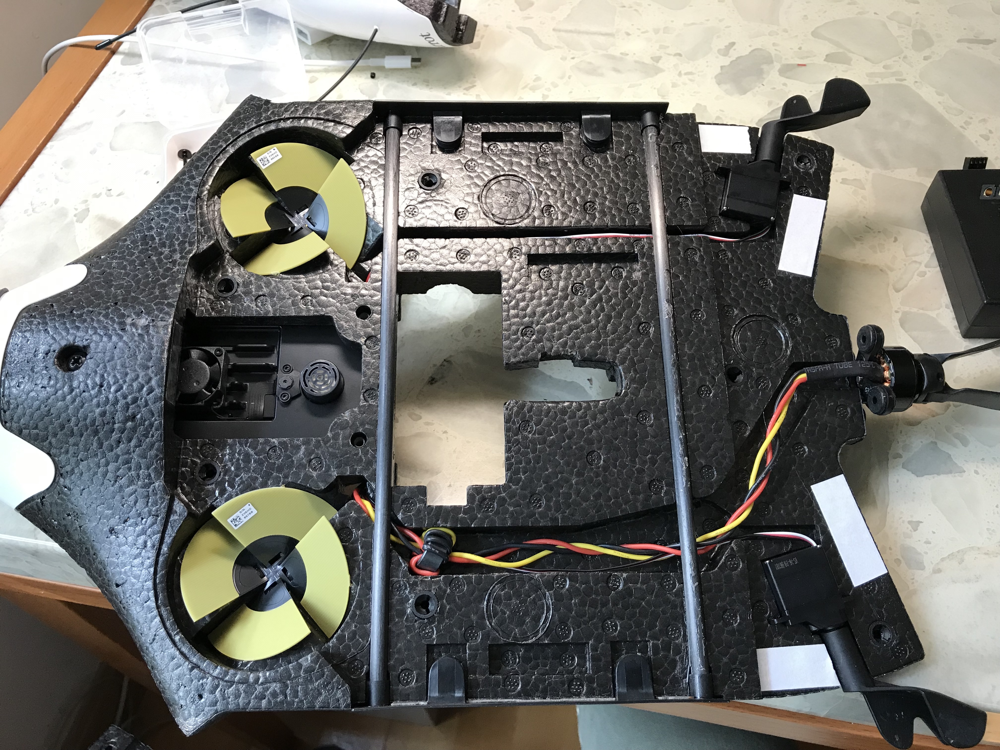

# PxPi Drone Project 2020

This project is to install Pixhawk to Parrot Disco and use a 3G / 4G network to achieve the goal of `long-range ground station control`.

## The Goal
- **Network**
  - [ ] Over 20 km remote control drone
  - [ ] Bonding two 4G networks to imporive the speed and reliable
  - [x] Using Zerotier setup the virtual LAN to connect ground stations and drones
- **Video**
  - [x] Live streaming FPV vieo
  - [ ] Low latency video (< 150 ms ?)
  - [x] Remote control on/off video streaming
  - [ ] Remote control save HD video
- **Monitoring**
  - [x] Send live drone positions to the Glympse for backup
  - [ ] Send onboard computer upload/download speed to ground station
  - [ ] Sndd 3G/4G network status to ground station

## The Setup
- Body: **Parrot Disco**
- FC: **Pixhawk (FMU V2)**
- Onboard computer: **Raspberry Pi 3**
- Network: **HUAWEI E3372** (3G/4G)
- Firmware: **ArduPlane**

## The Parrot Disco body inside
