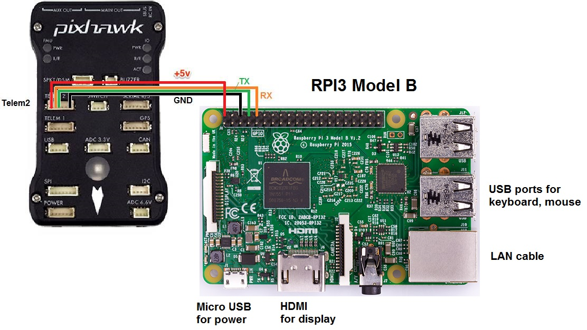

# RPi Setup

## Install and config basic Raspberry Pi
1. Download the Raspbian Buster Lite: https://www.raspberrypi.org/downloads/raspbian/
2. Read [rasp-basic.md](../rpi/basic-setup.md) for how to create the SD card image.

## Login
    Login: bellergy
    PW: xxxxxx

    Login: pi
    Pw: xxxxxx

## Join zerotier
    192.168.192.169

## Local domain
    pxpi.local

## WiFi config file
    sudo pico /etc/wpa_supplicant/wpa_supplicant.conf

## Add to /boot/config.txt
    enable_uart=1
    # Disable build-in Bluetooth
    dtoverlay=pi3-disable-bt

    # Disable build-in WiFi (I use the USB WiFi)
    dtoverlay=pi3-disable-wifi

## Disable Bluetooth
    sudo systemctl disable hciuart.service
    sudo systemctl disable bluealsa.service
    sudo systemctl disable bluetooth.service

## Install the required packages on the Raspberry Pi
https://ardupilot.org/dev/docs/raspberry-pi-via-mavlink.html

    sudo apt-get update

    sudo apt-get install screen python-wxgtk3.0 python-matplotlib python-opencv python-pip python-numpy python-dev libxml2-dev libxslt-dev python-lxml

    sudo pip install future pymavlink mavproxy requests dronekit

---
## Connect Huawei E3372 USB 
The Huawei E3372 can plug & play, but don't know why the rpi can't connect Internet with it. I install `network-manager` and use `nmcli` to check the network status. THEN, it works!

    sudo apt-get install network-manager

View the network status (https://www.mankier.com/7/nmcli-examples)

    nmcli

[Reference here](https://bkjaya.wordpress.com/2018/09/05/internet-connection-to-raspberry-pi-3-raspbian-stretch-with-a-4g-huawei-mobile-broadband-lte-usb-stick-huawei-e3372-using-wvdial/)

---
## Start up the mavproxy
[Reference](https://ardupilot.org/dev/docs/raspberry-pi-via-mavlink.html)

### Wiring
Don't use Pixhawk provide prower to RPI. A external 5V 2A power is requireqed.

---
## Install and stup the video Streaming
Read detail [here](../rpi/video-streaming.md) 

### If need to change the ground station IP/video config, edit this file:

    sudo pico /etc/systemd/system/raspicam.service

### Edit the config

    [Unit]
    Description=raspivid
    After=network.target

    [Service]
    ExecStart=/bin/sh -c "//usr/bin/raspivid -n -w 320 -h 180 -rot 180 -b 500000 -fps 15 -ISO 800 -vs -drc high -t 0 -o - | gst-launch-1.0 -v fdsrc ! h264parse ! rtph264pay config-interval=10 pt=96 ! udpsink host=192.168.192.101 port=5600"

    [Install]
    WantedBy=default.target

| raspivid options | Descriptions                                 |
| ---------------- | -------------------------------------------- |
| -n               | No preview window                            |
| -b               | bitrate (1000000 = 10Mbits/s)                |
| -t 0             | timeout 0 = run continuously                 |
| -o -             | output file '-' all output is sent to stdout |
| -vs              | Turn on video stabilisation                  |
| -ex auto/night   | Exposure auto or night mode                  |
| -drc high        | Increasing the range of dark areas,          |
|                  | and decreasing the brighter areas            |

### Enable the raspicam service

    sudo systemctl enable raspicam
    sudo systemctl daemon-reload
    sudo systemctl start raspicam

### Restart the raspicam service

    sudo systemctl stop raspicam
    sudo systemctl start raspicam

### Disable the raspicam service

    sudo systemctl disable raspicam
    sudo systemctl daemon-reload

---
## Install dronekit python
https://dronekit-python.readthedocs.io/en/latest/guide/quick_start.html

---
## Reference:
- https://ardupilot.org/dev/docs/raspberry-pi-via-mavlink.html
- https://thisdavej.com/create-a-lightweight-raspberry-pi-system-with-raspbian-lite/
- https://xb-uav.com/getting-started/overview