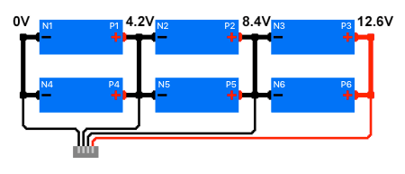
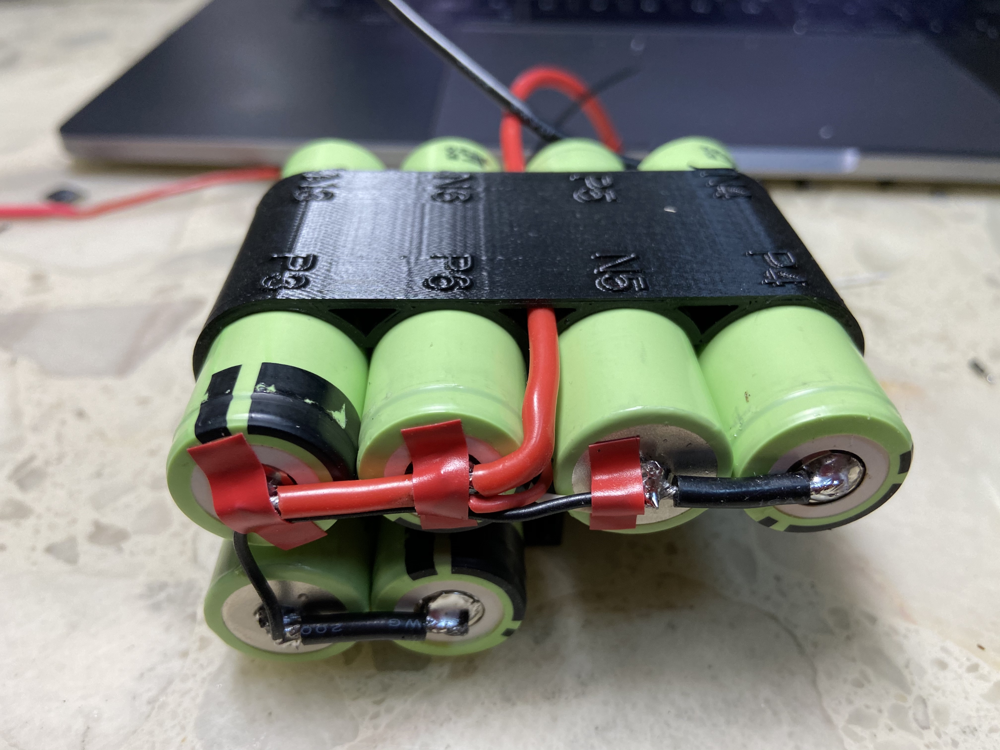
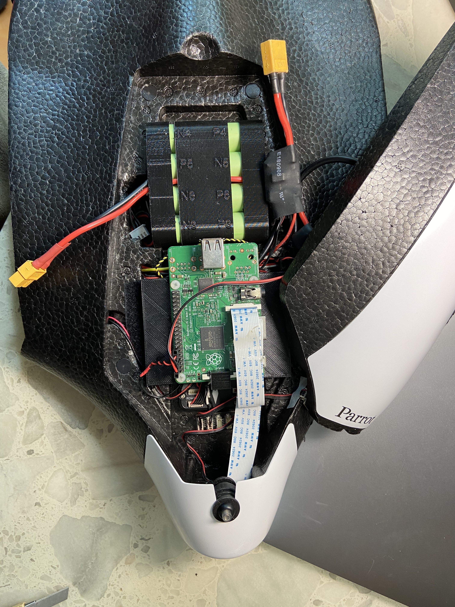

# 18650 Battery

## Sony 18650 VTC6
[Information](https://www.imrbatteries.com/sony-vtc5a-18650-2600mah-25a-flat-top-battery/)

[HK Shop](http://www.torch.com.hk/tc/product?no=1330)

## Panasonic NCR18650B Li-ion Battery
[Spec](https://www.batteryspace.com/prod-specs/NCR18650B.pdf)\
[Info](https://blog.seidel-philipp.de/diy-build-a-longrange-lithium-ion-battery/)\
[c Rate calculator](https://power-calculation.com/battery-storage-calculator.php)\
[Battery Finder](https://voltaplex.com/lithium-ion-battery-pack/18650-battery-pack)\
[NCR18650B 3S2P description](https://voltaplex.com/3s2p-10.8v-6.7ah-li-ion-18650-battery-pack-panasonic-b-cuboid)

## 1S1P
    Nominal volage: 3.6V
    Capacity: 3250mAh (min.)
    Weight: 48.5g
    Charging: 0.5C (1625mA)
    Discharge rate: 4.87A (1.5C)

## 3S2P
    3.6v x 3s = 10.8v
    3250mAh x 2p = 6500mAh
    48.5g x 6 = 291g (without wires)
    Continuous Discharge Rating = 9.75A

## 4S3P
    3.6v x 4s = 14.4v
    3250mAh x 3p = 9750mAh
    48.5g x 12 = 582g
    Continuous Discharge Rating = 14.625A

## 4S6P
    3250mAh x 6p = 19,500mAh
    48.5g x 24 = 1,154g
    Continuous Discharge Rating = 29.250A

## 4S7P
    3250mAh x 7p = 22,750mAh
    48.5g x 28 = 1,358g
    Continuous Discharge Rating = 34.125A

## 4S8P
    3250mAh x 8p = 26,000mAh
    48.5g x 28 = 1,552g
    Continuous Discharge Rating = 40.200A

## Suggest change rate: 0.5C
    6.5A * 0.5C = 3.25A

### Size: 
    Unit size: 18.5 x 18.5 x 65.3mm
    18.5 x 3 = 55.5
    18.5 x 2 = 37
    height = 65.3
    Binded size: 55.5 x 37 x 65.3 (Wiring and packing not included)

SET vorange range 
from 3.1v to 4.1v

## 熱縮膠
[淘宝](https://item.taobao.com/item.htm?spm=a230r.1.14.134.4c07357dJATFbB&id=528064272872&ns=1&abbucket=1#detail)

## 3D Print
[Center Spacer](https://www.thingiverse.com/thing:2798002)
[Holder](https://www.thingiverse.com/thing:2348345)